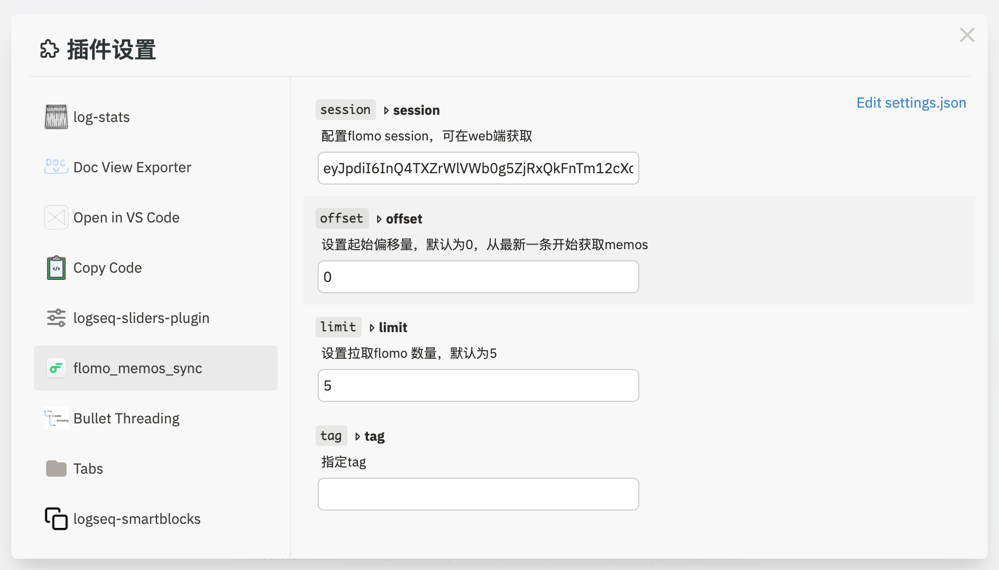
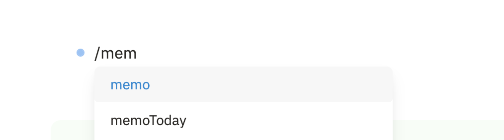

## flomo_memos_sync

同步 flomo 笔记至 logseq

## 环境配置

session 必须配置

## 使用

`/memo` 按照配置同步当前 flomo 笔记
`/memoToday` 同步今日 memo 笔记

## 其他

- [flomo 请求代理](https://github.com/duiliuliu/flomo-api-proxy/blob/main/pages/api/flomo.js)
- [logseq 插件模板](https://github.com/QWxleA/logseq-plugin-starter-template)

